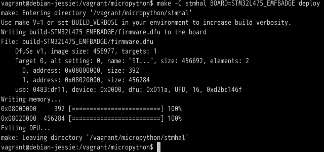

# Tilda Mk3 Hacking VM



This creates a [Vagrant](http://www.vagrantup.com) VM that contains all tools required to build firmware for the Mk3.
It is particularly useful if you run Windows or MacOS X.

## Installation

* Install VirtualBox, VMWare or Parallels Desktop.
* Install Vagrant.
* Clone this repo.
* `vagrant up`

## Using this image

Per [instructions](https://badge.emfcamp.org/wiki/TiLDA_MK3/build), run the following:

```
$ vagrant ssh
$ cd /vagrant
$ git clone --recursive git@github.com:emfcamp/micropython.git
$ cd micropython
$ git checkout tilda-master
# Now we can build the firmware and flash it to the badge
# You have to boot the badge into dfu mode by pressing down the center
# joystick button while pressing the reset button to trigger a reboot
make -C stmhal BOARD=STM32L475_EMFBADGE deploy
```

## License

Public Domain

